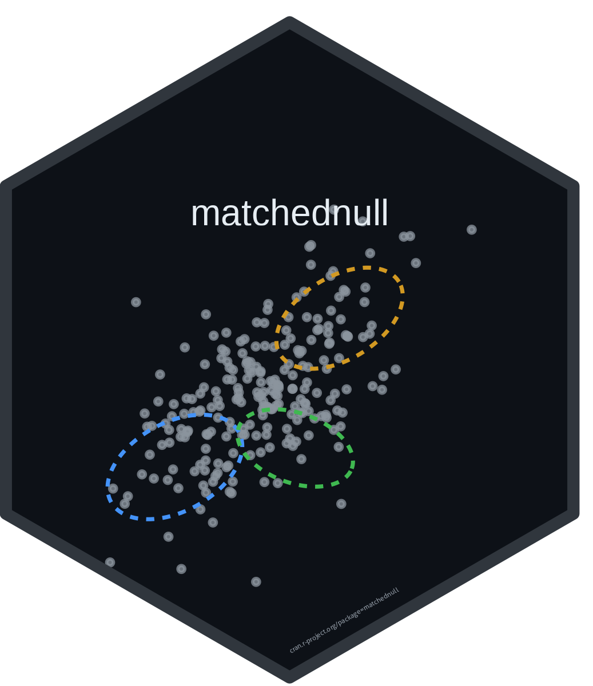

# matchednull 

[](https://CRAN.R-project.org/package=matchednull)
[](https://opensource.org/licenses/MIT)
[](https://doi.org/10.17605/OSF.IO/2EKCG)
[](https://doi.org/10.5281/zenodo.21610608)

Clustering methods will always give you clusters, even when the data are one
smooth cloud. That makes it hard to know whether the reported clusters reflect
real structure or are simply artifacts of the method.

matchednull helps you find out. It creates a null twin of your dataset with
exactly the same marginal distributions and approximately the same correlation
structure, but no cluster structure by construction. You then run your own
clustering pipeline on both the observed data and the null twins. If the
observed data consistently yield more clusters than the null twins, that's
evidence of genuine cluster structure. Otherwise, you'll know before a
reviewer asks.

<p align="center">
  
  
</p>

*Positive controls. Signal strength is the within-component correlation in
panel A and the separation between means, in standard deviations, in panel B.
The grey shaded band is the matched null's 95% interval: a point is red
(detected) when the real number of clusters exceeds the band, grey (null-like)
when it falls inside. The test finds real types whether they live only in the
correlation structure (A) or in well-separated means (B).*

One thing in that figure is worth a second look: in panel B the test stops
firing at the largest separation, which is the opposite of what a power curve
should do. [**How it works**](https://haomeng797-ship-it.github.io/matchednull/articles/how-it-works.html)
follows the construction out to that point, explains what the test is declining
to answer there, and shows the calibration behind the rest of the figure.

`copula_null()` generates the null twins, preserving every marginal
distribution exactly and the correlation matrix to within sampling error.
`matched_null_test()` applies any user-supplied clustering pipeline to the
observed data and to `R` null twins, then tests whether the observed result
stands out from the null distribution.

## Installation

```r
install.packages("matchednull")

# dev version, has the t-copula stress test
remotes::install_github("haomeng797-ship-it/matchednull")
```

## Quick example

```r
library(matchednull)
library(mclust)

pick_k <- function(d) Mclust(d, G = 1:5, verbose = FALSE)$G

set.seed(1)
x <- matrix(rnorm(500 * 4), 500, 4)   # typeless data
set.seed(2)
matched_null_test(x, pick_k, R = 50)
#> Matched-null test (50 Gaussian null twins)
#>   real statistic:      1
#>   null interval:       [1, 1]
#>   p (real >= nulls):   1
#>   verdict:             null-like (within the twins' interval)
```

See `vignette("matchednull")` for the full walk-through, including a case
where genuine types hide in the dependence structure and the test fires.

In our calibration runs on skewed but clusterless data, standard criteria
(BIC, the bootstrap LRT) reported structure in every dataset. The matched-null
test flagged none of them.

## Reference

The method, its positive controls, and its false-positive calibration are
described in the accompanying paper *Types Without Taxa* (Meng, 2026;
preregistration: <https://osf.io/2ekcg>).
