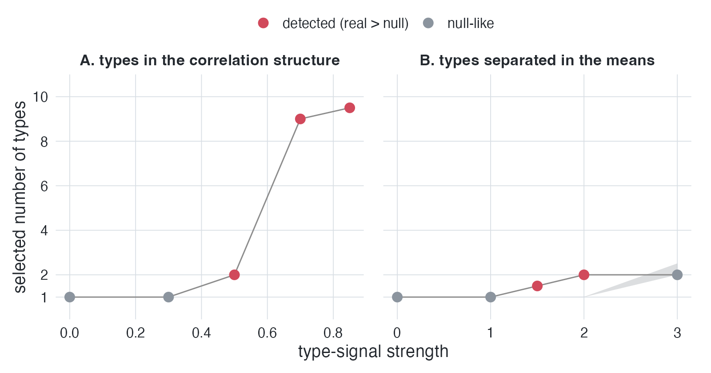
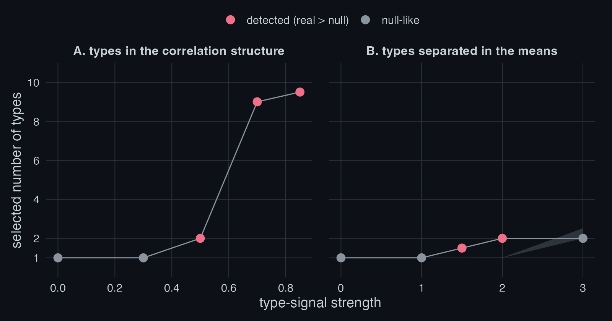
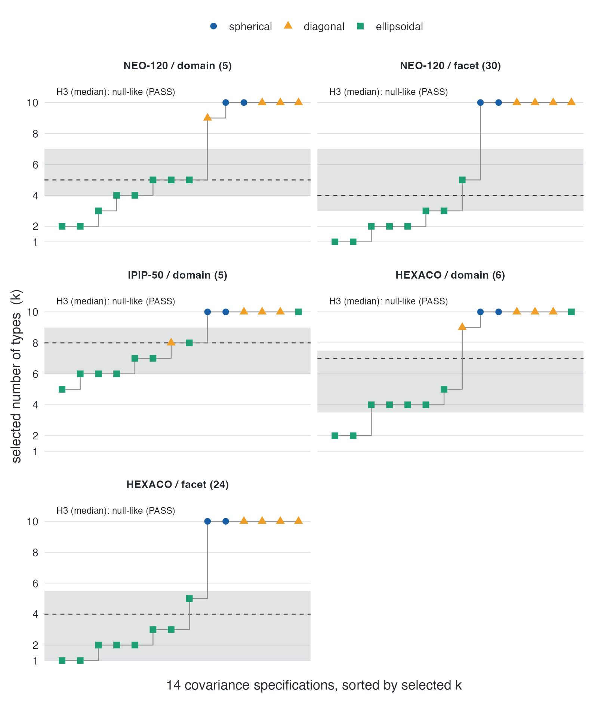
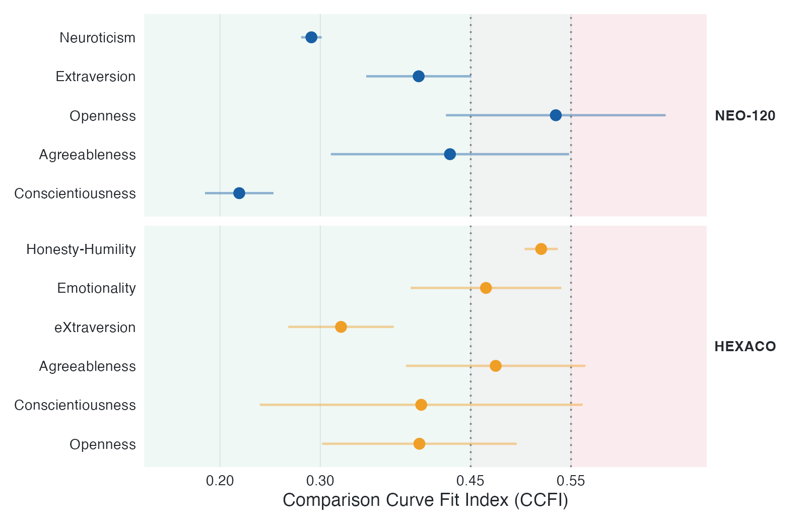

```{r, include = FALSE}
knitr::opts_chunk$set(
  collapse = TRUE,
  comment = "#>",
  echo = TRUE,
  eval = FALSE
)
```

## The problem: clustering always returns clusters

Give a clustering method a single smooth cloud of points and it will still
return clusters. Model-selection criteria behave the same way: BIC, the
bootstrap likelihood-ratio test, the gap statistic all pick *some* number of
groups, and on data with skew or correlation they often pick several. So when
an analysis reports that a dataset contains, say, four personality types, the
number may describe the population, or it may describe only the shape of the
data under that method. Nothing in the output tells you which.

The matched-null test separates the two by asking a single question: **would a
dataset with the same margins and the same correlations, but no types, have
produced the same answer?**

## Constructing the matched null

We want a reference dataset that matches the real one in every respect that is
*not* in question, and is empty of the one thing that is. Two features are not
in question and must be preserved:

* every variable's marginal distribution (its skew, its bounds, its lumps at
  round numbers on a Likert scale);
* the correlations among variables.

The feature in question, latent groups, must be absent by construction.

A Gaussian copula does exactly this. Write the data as columns
$X_1, \dots, X_p$ with empirical marginal distributions $F_1, \dots, F_p$ and
correlation matrix $R$. The null twin $Y$ is built in two steps:

1. draw $Z \sim \mathcal{N}(0, \Omega)$, where $\Omega$ is chosen so that
   the induced correlations match $R$;
2. push each column back through its own empirical quantile function,
   $Y_j = F_j^{-1}\!\big(\Phi(Z_j)\big)$, which reuses the observed
   values of variable $j$.

By Sklar's theorem the joint law of $Y$ is the Gaussian copula with
margins $F_j$. Three things follow. Each $Y_j$ has *exactly* the
empirical distribution of $X_j$: the twin is a reshuffling of the real
values, so no marginal test can tell them apart. The correlation matrix of
$Y$ equals $R$ to within sampling error. And the joint density is
unimodal, with no islands or gaps, so **the twin contains no cluster structure
by construction**. Any clusters your pipeline reports on the twin are
therefore manufactured by the pipeline, not carried by the data.

```r
library(matchednull)

set.seed(1)
x <- matrix(rnorm(400 * 3), 400, 3) %*%
  chol(matrix(c(1, .5, .3, .5, 1, .4, .3, .4, 1), 3, 3))

twin <- copula_null(x)
all(sort(twin[, 1]) == sort(x[, 1]))   # margins: identical
round(cor(x) - cor(twin), 2)           # correlations: close
```

## The test statistic

Let $T(\cdot)$ be your pipeline, wrapped as a function that returns one number,
typically the selected number of clusters, but it can be any scalar measure of
clustering strength. Compute the real statistic $t_0 = T(X)$, then generate
$R$ twins and compute $t_1, \dots, t_R$ with $t_r = T(Y^{(r)})$. The
one-sided $p$-value is

$$
p \;=\; \frac{1 + \#\{\, r : t_r \ge t_0 \,\}}{R + 1}.
$$

The verdict reads *null-like* when $t_0$ sits inside the interval the twins
produce, and *exceeds the null* when the real data stand out. The null is
defined at the level of the data, not the pipeline, so the same twins work for
a $k$-means heuristic, a published typology's exact workflow, or a mixture
model.

```r
matched_null_test(x, cluster_fn = function(d) mclust::Mclust(d, verbose = FALSE)$G, R = 200)
```

## Positive controls: sensitivity to genuine types

A test that never fires is worthless: it must stay quiet on typeless data
*and* fire when genuine types are present. The two panels below plant real
types of two kinds and raise the signal strength.

<figure>


<figcaption>Positive controls. Signal strength is the within-component
correlation in panel A and the separation between means, in standard
deviations, in panel B. The grey shaded band is the 95% interval of the
matched-null median k: a point is red (detected) when the real value exceeds
the band and grey (null-like) when it falls inside. In panel B the band widens
at the largest separation, where the groups become visible in the margins
themselves and the margin-preserving null reproduces them, so the point reads
null-like.</figcaption>
</figure>

In the left panel the types share identical margins and differ only in the
*orientation* of their within-group correlations. A single Gaussian copula
has one correlation matrix and cannot reproduce two, so as the within-group
correlation grows the test fires. This is the regime that ordinary
mean-comparison and marginal tests miss entirely: the groups are invisible one
variable at a time and appear only in the joint dependence. In the right panel
the types are separated in their means in the familiar way, and the test again
fires as the separation grows. Where there is structure the matched null
cannot carry, the test finds it.

## Empirical application: personality inventories

The motivating application is the claim that personality inventories contain a
small number of latent "types." Running the test across all fourteen `mclust`
covariance parameterizations, on several public Big Five and HEXACO datasets,
gives the specification curve below.

<figure class="fig-paper">

<figcaption>Selected number of types across all fourteen mclust covariance
models (steps), against the null band the twins produce (grey). The median
verdict is null-like in every dataset.</figcaption>
</figure>

The number of types the pipeline selects (the step function) sits inside the
band the twins produce (grey) for the great majority of specifications, and the
median verdict is null-like in every dataset. The handful of specifications
that climb above the band are the most flexible covariance models, which read
the data's skew and correlation as extra components; the twins, which share
that skew and correlation, climb with them. The apparent "types" are the shape
of the data under `mclust`, not latent kinds of people.

## Convergent evidence from taxometrics

The mixture-model result lines up with an older tradition. The Comparison
Curve Fit Index (CCFI) from taxometric analysis scores whether a construct is
better described as categorical (taxonic) or continuous (dimensional), with
values below the midpoint favouring a dimensional structure.

<figure class="fig-paper">

<figcaption>Comparison Curve Fit Index by trait for NEO-120 and HEXACO. Values
fall on the dimensional side of the midpoint throughout.</figcaption>
</figure>

Every trait, in both inventories, falls on the dimensional side. Two
methodological traditions that rarely meet, mixture-model cluster counting and
taxometrics, return the same verdict, which is reassuring precisely because
their assumptions differ.

## Heavy-tailed alternatives: the t-copula null

A verdict of *exceeds the Gaussian null* licenses only the conclusion that the
data carry structure beyond their margins and correlations. That structure
need not be types. Heavy-tailed dependence, where extreme values across
variables tend to arrive together, also exceeds a Gaussian null, and real
questionnaire and clinical data are heavy-tailed more often than not. To keep
the two readings apart, rerun the test with t-copula twins: same margins, same
correlations, but tails that co-move.

```r
matched_null_test(x, cluster_fn, R = 200, copula = "t", df = 8)  # moderate tails
matched_null_test(x, cluster_fn, R = 200, copula = "t", df = 3)  # heavy tails
```

The ladder reads simply. A result that exceeds the Gaussian twins *and* the t
twins is hard to attribute to tails. A result the t twins reproduce was tail
dependence, not types. Either way the verdict is sharper than a single null
could give.

## A boundary case: separation in the margins

The one regime the null cannot flag is types so separated that the separation
shows up in the margins themselves, turning a variable visibly bimodal. There
the twin, which copies that bimodal margin, inherits the split and reports the
same count, so the test stays quiet on a structure that is in fact real. This
is a feature at the boundary rather than a defect: a variable that is plainly
two-humped needs no null to reveal its groups. Inspect the margins for
pronounced multimodality before relying on the count test, and tie-break
granular Likert-type scales before formal unimodality tests.

## Related approaches

Testing a clustering result against a reference distribution is an old idea,
and the choice of reference is what separates the methods.

The gap statistic (Tibshirani, Walther, and Hastie, 2001) compares the observed
within-cluster dispersion to a uniform or PCA-aligned reference, which ignores
the correlation structure of the data. SigClust (Liu, Hayes, Nobel, and Marron,
2008) tests a single two-way split against a single Gaussian null. Neither
preserves the marginal distributions, which matters for the skewed and granular
scales common in questionnaire data.

The closest relative is UNPaC (Helgeson, Vock, and Bair, 2021), which also
builds its reference with a Gaussian copula. Two things differ. UNPaC's
reference is *ortho-unimodal*: the margins are smoothed by kernel density
estimation and made unimodal, so a bimodal variable counts as evidence for
clustering. `matchednull` reuses the observed values, so the margins of the
twin are identical to the real ones and marginal shape is conceded to the null.
The test is therefore the more conservative of the two, and it answers a
narrower question: is there cluster structure *beyond* what the margins and
correlations already imply. UNPaC also compares a fixed cluster index, while
`matched_null_test()` compares whatever scalar the user's own pipeline returns,
which is what allows a published typology's exact workflow to be tested as it
was actually run.

The two are complements rather than substitutes. A result that clears the
unimodal reference of UNPaC and the margin-preserving reference here is
supported by both readings.

## References

The method, its positive controls, and its false-positive calibration are
described in the accompanying paper, *Types Without Taxa: A
Covariance-Matched-Null Multiverse Test of Categorical versus Continuous
Personality Structure* (Meng, 2026; preregistration:
<https://doi.org/10.17605/OSF.IO/2EKCG>).

Helgeson, E. S., Vock, D. M., and Bair, E. (2021). Nonparametric cluster
significance testing with reference to a unimodal null distribution.
*Biometrics*, 77(4), 1215-1226.
<https://doi.org/10.1111/biom.13376>

Liu, Y., Hayes, D. N., Nobel, A., and Marron, J. S. (2008). Statistical
significance of clustering for high-dimension, low-sample size data.
*Journal of the American Statistical Association*, 103(483), 1281-1293.
<https://doi.org/10.1198/016214508000000454>

Tibshirani, R., Walther, G., and Hastie, T. (2001). Estimating the number of
clusters in a data set via the gap statistic. *Journal of the Royal Statistical
Society Series B*, 63(2), 411-423.
<https://doi.org/10.1111/1467-9868.00293>
